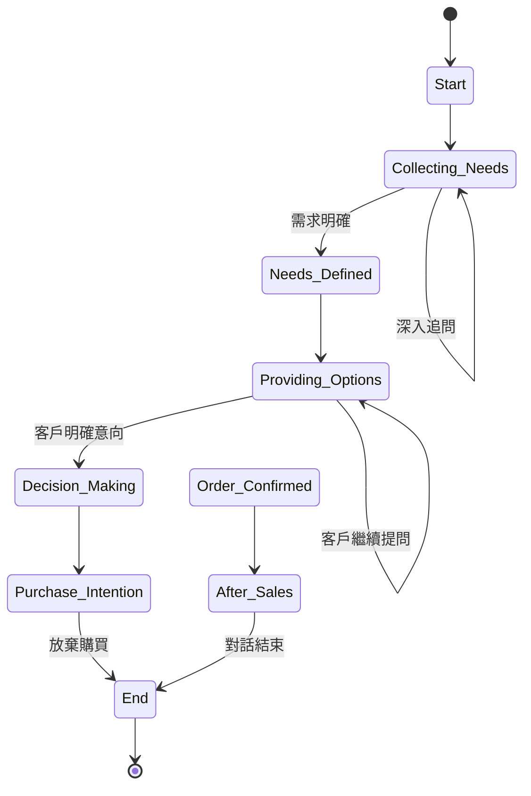

# MGFD 系統架構分析報告

### **報告日期**: 2025-08-26 04:24

### **系統版本**: MGFD SalesRAG Integration System v0.4

### **分析範圍**: 完整系統架構、模組依賴、配置文件使用分析

### 前言：

### 基於之前第一版及第二版設計的缺點，v4.2(or v4.1)以 centre-decide, extended rule-based and stat-machine-based重新設計一個通用、可靠、人機合作及容易除錯的RAG範式。

### 1. 系統模組組成

### 五大子模組:

### * UserInputHandler : 輸入處理層

### * ResponseGenHandler : 回應生成層

### * KnowledgeManagementHandler:內部產品資料及其它文件取得，目前以parent-child chunking實作。

### * PromptManagementHandler : 提示工程管理層

### * StateManagementHandler : 狀態管理層

### 1.1 核心模組架構

### **主控制器層**

### ```

### MGFDSystem (mgfd_system.py)

### ├── 系統初始化和協調

### ├── 工作流程管理

### └── 統一接口提供

### ```

### **輸入處理層**

### ```

### UserInputHandler (user_input_handler.py)

### ├── 用戶輸入解析

### ├── 槽位提取協調

### └── 狀態更新管理

### ```

### **回應生成層**

### ```

### ResponseGenerator (response_generator.py)

### ├── 回應格式化

### ├── 前端渲染信息

### ├── 多類型回應處理

### └── JSON序列化

### ```

### **知識庫層（整合Chunking搜尋核心）**

### ```

### NotebookKnowledgeBase (knowledge_base.py)

### ├── 產品數據管理

### ├── Chunking搜尋引擎整合

### │   ├── ProductChunkingEngine - Parent-Child分塊策略

### │   ├── 語義嵌入向量生成

### │   └── 餘弦相似度計算

### ├── 語義搜索（基於Chunking）

### ├── 智能推薦引擎

### └── RDBMS and NoSQL搜尋

### ```

### 提示工程管理層

### ```

### PromptManager (prompt_manager.py)

### ├── 依據情境選擇合適的提示

### ├── 提示庫建立與管理

### ├── 提示內容語義比對

### ├── 自動化提示生成系統的規劃與實驗

### ├── Multi-Hop Prompt

### └── To-Add

### ```

### 狀態管理層

### ```

### StateManager (state_manager.py)

### (MGFD State Manager Merges state persistence (Redis) and state transition logic (State Machine))

### ├── 狀態轉換管理

### ├── 流程控制

### ├── 事件處理

### ├── 會話狀態持久化

### ├── 對話歷史管理

### ├── 槽位信息存儲

### └──

### ```

# 1.2 模組功能詳細分析

### 所有模組運作總述：

* 狀態管理
  每一個新的客戶與AI會話開始，在redis中就要建立一個Chat State Machine:



整個對話的完整流程即依照這個State Machine在進行。 User與System間會經常有溝通進行，System對話的目的在收集槽位(slot)資訊。

整個行為的流程如下：

1. user input -> api router -> MGFDSystem
2. ……

---

### 我會先用一個案例來描述這個系統的完整且符合預期的行為。

### case-1:

### user-input-1 :"請介紹目前新出的筆電"-> system:各模組進行處理，發現需要啟動funnnel chat進行槽位資料收集->system:依照預設的槽位資料收集的問題向客戶詢問->客戶回答->[optional:若預到系統無法理解的字詞，請詢問LLM，並產生回答與客戶進行確認，直到確定後，再繼續進行槽位資料收集]->system進行槽位資料收集->直到槽位資料滿足可以進行產品查詢->**system使用Chunking語義搜尋引擎進行產品搜尋**->呈現產品詳細規格給客戶。

---

### 1.3 **Chunking搜尋核心整合說明**

### Chunking架構優勢：

### 1. **Parent-Child分層結構**：每個產品生成1個父分塊（概覽）+ 4個子分塊（效能、設計、連接性、商務）

### 2. **語義搜尋能力**：基於sentence-transformers模型，支援自然語言查詢

### 3. **多維度匹配**：從不同角度（效能、便攜性、商務需求）匹配用戶需求

### 4. **相似度評分**：提供匹配度百分比和推薦原因，增強用戶體驗

### 搜尋流程：

### 1. 槽位信息 → 構建搜尋查詢文本

### 2. 生成查詢嵌入向量

### 3. 與產品分塊庫進行餘弦相似度計算

### 4. 返回相似度>30%的分塊結果

### 5. 轉換為產品列表，包含匹配原因和評分

### 以上是一個基於Chunking語義搜尋的完整流程，已成功整合到Case-1系統功能中。

---

### Action thinking, plan and implementation

### 好的，這就為您呈現 `dataclass` 的定義以及完整的狀態表格式與內容。這兩部分是表驅動方法的核心，它們將狀態機的「規則」從執行「邏輯」中清晰地分離出來。

---

### 1. `StateTransition` 資料類別 (Dataclass) 的內容

### 這是用來定義單一狀態轉換規則的結構藍圖。我們使用 `dataclass` 是為了讓每個狀態的屬性（包含哪些動作、下一個狀態是什麼）都有明確的名稱，增加程式碼的可讀性。

### **程式碼片段**

### ```

### from dataclasses import dataclass

### from typing import List, Callable

### ... (action functions are defined here) ...

### @dataclass

### class StateTransition:

### """

### 一個用來存放指定狀態的動作列表與下一個狀態的資料類別。

### A data class to hold the actions and next state for a given state.

### """

### actions: List[Callable[[], None]]

### next_state: str

### ```

### **解說:**

### * **`@dataclass`** : 這是一個裝飾器，它會自動為這個類別產生一些基礎方法，例如 `__init__`，讓我們的定義可以非常簡潔。

### * **`actions: List[Callable[[], None]]`** : 這個欄位用來存放一個「動作函式」的列表。

### * `List[...]` 表示它是一個列表。

### * `Callable[[], None]` 是一個型別提示 (Type Hint)，它精確地描述了列表中的成員：

### * `Callable`: 表示它是一個可以被呼叫的物件（通常是函式）。

### * `[]`: 表示這個函式不接收任何參數。

### * `None`: 表示這個函式沒有回傳值。

### * **`next_state: str`** : 這個欄位就是一個簡單的字串，用來儲存執行完所有 `actions` 後，應該轉換到的下一個狀態的名稱。

### ---

### 2. 完整狀態表 (`STATE_TRANSITIONS`) 的格式與內容

### 這個字典就是我們狀態機的「大腦」。它以狀態名稱為「鍵」，以 `StateTransition` 物件為「值」，完整地描述了所有可能的狀態轉換路徑。

### **程式碼片段**

### ```

### ... (action functions and StateTransition class are defined here) ...

### STATE_TRANSITIONS: Dict[str, StateTransition] = {

### "receiveChat": StateTransition(

### actions=[matchword, matchsentence],

### next_state="formatOutput"

### ),

### "formatOutput": StateTransition(

### actions=[transformdata, outputmdtable],

### next_state="presentTable"

### ),

### "presentTable": StateTransition(

### actions=[validatemdtable, sendtofront],

### next_state="waitforresponse"

### ),

### }

### ```

### **解說:**

### * **格式** :

### * 它是一個字典 (`Dict`)。

### * **鍵 (Key)** : 狀態的名稱 ( `str` )，例如 `"receiveChat"`。

### * **值 (Value)** : 一個 `StateTransition` 物件的實例。

### * **內容分析** :

### * 當狀態機的當前狀態是 **`"receiveChat"`** 時：

### 1. 它會查詢到對應的 `StateTransition` 物件。

### 2. 接著執行 `actions` 列表中的 `matchword` 和 `matchsentence` 這兩個函式。

### 3. 最後將狀態更新為 `next_state` 所指定的  **`"formatOutput"`** 。

### * `"formatOutput"` 和 `"presentTable"` 的規則也依此類推。

### * 請注意，`"waitforresponse"` 並沒有出現在字典的「鍵」中。這意味著當狀態轉換到 `"waitforresponse"` 時，它就成了一個 **終止狀態 (Terminal State)** ，狀態機引擎會因為找不到下一步的規則而停止執行。

### 這個設計將所有業務邏輯都集中在了這個 `STATE_TRANSITIONS` 字典中，如果未來需要修改流程或新增狀態，您幾乎只需要維護這個區塊即可。

### 如果Callable要能接收參數，要怎麼宣告?

### **顯示思路**

### [MODE: INNOVATE]

### 這是一個非常好的問題，直接關係到如何讓狀態機處理實際的資料流程，而不僅僅是執行固定的無參數動作。要讓 `Callable` 接收參數，我們需要同時升級三個部分： **Type Hint 的宣告** 、 **動作函式的定義** ，以及 **狀態機引擎的呼叫方式** 。

### 目前最通用且強大的設計模式是引入一個「 **共享情境 (Shared Context)** 」物件。

### **核心構想：**

### 狀態機在執行過程中，不僅僅是狀態的跳轉，更重要的是資料的處理與傳遞。我們可以建立一個 `context` 物件（通常是一個字典或自訂類別），並讓它在整個狀態機的生命週期中存在。這個 `context` 會作為一個「資料載體」，在每一步被傳遞給動作函式。動作函式可以從中讀取前序步驟的結果，並將自己的處理結果寫入其中，供後續步驟使用。

### **我們可以探討兩種主要的實現方式：**

### **方案一：使用字典作為共享情境 (建議)**

### 這是在 Python 中最靈活、最常見的作法。

### 1. **宣告方式** ：`Callable` 的宣告會改變。如果我們用字典 `dict` 當作 context，並且動作函式不回傳值，那麼型別提示會像這樣：

### * `from typing import Dict, Any`

### * `Callable[[Dict[str, Any]], None]`

### * 這段宣告的意思是：「一個可呼叫的物件，它接收一個參數（型別為 `Dict[str, Any]`，即鍵為字串、值為任意型別的字典），並且沒有回傳值 (`None`)。」

### 1. **設計影響** ：

### * **動作函式** ：所有的動作函式定義都需修改，以接收 `context` 字典。例如：

### **Python**

### ```python

### def matchword(context: Dict[str, Any]):

### # 從 context 讀取原始對話

### chat_input = context.get("raw_chat", "")

### # 將匹配到的詞寫回 context

### context["matched_words"] = ["hello", "world"]

### print(f"  - Action: Matching keywords in ''...")

### ```

### * **狀態機引擎** ：`StateMachine` 類別需要增加一個 `context` 屬性，並在 `run_step` 方法中呼叫動作時，將這個 `context` 傳遞進去：

### **Python**

### ```python

### # In StateMachine.run_step

### for action in transition.actions:

### action(self.context) # 將 context 傳遞給函式

### ```

### * **優點** ：極度靈活，容易擴充。函式之間透過一個共用的字典來解耦，不需要關心彼此的參數簽名。

### * **缺點** ：因為字典的值是 `Any`，編譯時期的型別檢查較弱。

### **方案二：在狀態表中靜態定義參數**

### 這種方式是將參數直接定義在狀態表裡，適用於參數是固定的、在狀態機啟動前就知道的場景。

### 1. **宣告方式** ：這會讓狀態表的結構變得複雜。`actions` 列表儲存的不再是函式本身，而可能是 `(函式, [參數列表])` 這樣的元組。

### **Python**

### ```python

### # 結構範例

### "receiveChat": StateTransition(

### actions=[

### (matchword, ["some_static_keyword"]),

### (matchsentence, [True]) # True for case_sensitive

### ],

### next_state="formatOutput"

### ),

### ```

### 1. **設計影響** ：

### * `StateMachine` 引擎的 `run_step` 邏輯需要被大幅修改，以解析這種元組結構，並使用 `*args` 的方式來呼叫函式。

### * 這種方法無法解決「一個動作的輸出是下一個動作的輸入」這種動態資料流問題。

### **結論與建議：**

### 對於您描述的任務，**方案一：使用共享情境字典** 是最理想的選擇。它不僅解決了如何向 `Callable` 傳遞參數的問題，還提供了一個強大且可擴充的機制來管理整個流程中的資料，這在真實世界的應用中至關重要。

### 我建議我們採納「共享情境」方案來升級現有的狀態機。

### 我的目的如下：

### 1.有時Callable有時不需要參數，必須回傳資料

### 2.有時Callable有時需要參數，必須回傳資料

### 請提出完整的設計，配合我們的table-driven state machine table

### **顯示思路**

### [MODE RESEARCH]

### 好的，我已經收到您更詳細的需求。這是一個重要的演進，讓狀態機從單純的「流程控制器」轉變為「資料處理管道」。我將對此進行深入分析。

### **需求解構與分析：**

### 您提出的新需求可以分解為以下幾個關鍵點：

### 1. **異質的函式簽名 (Heterogeneous Function Signatures)** ：

### * `Callable[[], T]`: 一種無須輸入參數，但會回傳資料 (`T`) 的動作。

### * `Callable[[...], T]`: 一種需要輸入參數，並且也會回傳資料 (`T`) 的動作。

### * 這兩種動作需要在同一個 `action list` 中共存。

### 1. **資料流管理 (Data Flow Management)** ：

### * **資料的來源** ：對於需要參數的函式，其輸入參數從何而來？是前一個動作的輸出嗎？還是某個全域的狀態？

### * **資料的目的地** ：所有動作函式回傳的資料 (`T`)，應該被如何處理？是作為下一個動作的輸入，還是被儲存起來？

### 1. **對現有設計的衝擊** ：

### * **引擎的複雜性** ：目前的 `StateMachine` 引擎只會單純地呼叫 `action()`。現在它必須有能力處理回傳值，並有條件地提供參數。直接在引擎中根據函式型別寫 `if/else` 判斷邏輯，會違背我們表驅動設計的初衷，使引擎變得複雜且僵硬。

### * **狀態表 (`STATE_TRANSITIONS`) 的結構** ：我們是否需要修改狀態表的結構來容納參數資訊或回傳值的處理指令？

### **核心挑戰分析：**

### 綜合來看，核心挑戰在於如何設計一個 **統一的介面 (Unified Interface)** ，讓狀態機引擎可以用一種標準化的方式與這些不同簽名的動作函式互動，同時建立一個清晰的資料傳遞機制。

**引出的關鍵問題：**

### 1. 我們如何設計一個「共享情境 (Shared Context)」，使其既能為需要參數的函式提供輸入，又能收集所有函式的輸出？

### 2. 我們如何標準化動作函式的呼叫方式，以便引擎不需要知道每個函式的具體參數需求？

### 3. 回傳的資料應該如何更新到「共享情境」中？是完全取代，還是部分合併 (merge)？部分合併似乎更安全，可以避免動作無意中破壞其他動作產生的資料。

### 我的研究表明，解決方案的關鍵在於定義一個所有動作函式都必須遵守的「 **標準合約 (Standard Contract)** 」。引擎只與這個「合約」互動，而將函式簽名的差異性在合約內部進行適配。

### 研究階段到此為止。我已經對問題的複雜性有了充分的理解，並確定了需要進一步創新的關鍵點。

### ENTER INNOVATE MODE

### 請發揮你的思考來設計這個「Standard Contract」

**顯示思路**

[MODE: INNOVATE]

### 好的，遵命。我們來設計這個「標準合約 (Standard Contract)」。這個合約的目標是創造一個所有動作函式都必須遵守的統一介面，使得狀態機引擎可以用一種優雅且一致的方式與它們互動，無論它們的內部邏輯有多大差異。

### 這個合約的核心，就是一個標準化的 **函式簽名 (Function Signature)** 。

---

### **提案：標準化動作合約**

我們規定，所有被放入狀態表 `actions` 列表中的函式，都必須遵循以下簽名：

**Python**

### ```python

### from typing import Dict, Any

### def action_function(context: Dict[str, Any]) -> Dict[str, Any]:

### """

### 一個標準動作函式的範本。

### Args:

### context: 一個包含當前所有狀態資料的字典。函式從這裡讀取輸入。

### Returns:

### 一個字典，包含此函式產生的、需要被合併回 context 的新資料。

### 如果函式沒有產生新資料，則應回傳一個空字典 {}。

### """

### # ... 函式邏輯 ...

### pass

### ```

### 這個合約包含兩條簡單而強大的規則：

### **規則一 (輸入)：萬物皆取於 `Context`**

### * 所有動作函式**必須**接收一個 `context` 字典作為其唯一參數。

### * **對於需要參數的函式** (您的需求2)：它應該從傳入的 `context` 字典中讀取它所需要的資料。例如：`user_id = context.get("user_id")`。

### * **對於不需要參數的函式** (您的需求1)：它在定義時依然要包含 `context` 參數，但在函式體內可以完全忽略它。這確保了呼叫介面的一致性。

### **規則二 (輸出)：萬物皆歸於 `Context` (以更新形式)**

### * 所有動作函式**必須**回傳一個字典。

### * 這個回傳的字典代表了 **對 `context` 的更新** 。它包含了此動作產生的新資料或修改後的資料。

### * 狀態機引擎在收到這個回傳的字典後，會使用 `update()` 方法將其合併 (merge) 回主 `context` 中。

### * 如果一個動作不產生任何需要被儲存的資料，它只需回傳一個 **空字典 `{}`** 。

---

### **設計思想與優勢**

這種「 **傳入 Context，回傳 Update** 」的模式，類似於函數式程式設計中的理念，帶來了幾個關鍵好處：

1. **引擎極簡化** ：狀態機引擎的執行迴圈變得非常簡單且穩定。它不需要關心每個動作的具體需求，只需重複執行一個固定的流程：
   **Python**

### ```python

### # 狀態機引擎中的核心邏輯

### for action in current_actions:

### updates = action(self.context)  # 遵守合約：用 context 呼叫

### self.context.update(updates)     # 遵守合約：用回傳值更新

### ```

1. **明確的資料流** ：資料的來源 (`context`) 和去向 (回傳的 `update` 字典) 都變得非常明確。這使得追蹤和除錯資料在不同動作之間的傳遞過程變得容易，有效避免了難以追蹤的「副作用 (Side Effects)」。
2. **高度的可組合性與可測試性** ：每個動作函式都變成了一個獨立的、可測試的單元。您只需要準備一個模擬的 `context` 字典就可以對它進行單元測試，驗證其回傳的 `update` 字典是否符合預期。

### **範例對比**

讓我們看看您的需求是如何被這個合約滿足的：

**需求1：無須參數，但需回傳資料**

* **舊思維** : `def get_current_time() -> str:`
* **新合約** :
  **Python**

### ```python

### def get_current_time(context: Dict[str, Any]) -> Dict[str, Any]:

### # context 參數被忽略

### print("  - Action: Getting current time...")

### return

### ```

**需求2：需要參數，且需回傳資料**

* **舊思維** : `def format_user_greeting(user_name: str) -> str:`

### * **新合約** :

### **Python**

### ```

### def format_user_greeting(context: Dict[str, Any]) -> Dict[str, Any]:

### user_name = context.get("user_name", "Guest") # 從 context 讀取

### print(f"  - Action: Formatting greeting for...")

### greeting = f"Hello,!"

### return # 將結果放入 update 字典回傳

### ```

### 這個「標準合約」的設計，為您的 Table-Driven 狀態機提供了一個既靈活又穩定的骨架，能夠優雅地處理複雜的資料處理任務。

### ENTER PLAN MODE

### 請進行詳細的實作計算，並且思考這個

### def action_function(context: Dict[str, Any]) -> Dict[str, Any]

### 該放到我們的5大核心子模組中的那一個，或者放在MGFD_SYS中

### 五大核心子模組:

### 1. UserInputHandler : 輸入處理層

### 2. ResponseGenHandler : 回應生成層

### 3. KnowledgeManagementHandler

### 4. PromptManagementHandler : 提示工程管理層

### 5. StateManagementHandler : 狀態管理層

請進行計畫

**顯示思路**

[MODE: PLAN]

好的，我們進入計畫模式。我將對「標準合約」的實作進行詳細規劃，並就其在您提供的系統架構中的位置進行分析與決策。

### **第一部分：架構規劃 (Architectural Placement)**

### 首先，我們來決定這些 `action_function` 應該放在哪個模組。這是一個關鍵的架構決策，它將影響系統的職責分離和未來的可維護性。

### **分析：**

### 1. **`action_function` 的本質** ：這些函式是「業務邏輯」的具體執行單元。例如，「驗證使用者密碼」是一個動作，其邏輯屬於知識庫或使用者管理；「生成歡迎訊息」是另一個動作，其邏輯屬於回應生成。

### 2. **`StateManagementHandler` 的職責** ：此模組的核心職責應該是「管理狀態」和「驅動流程」，而不是「執行業務邏輯」。它應該像一個交通警察，根據狀態表來指揮流程，告訴系統「下一步該做什麼」，但不應該親自去做那些事。

### 3. **職責分離原則 (Separation of Concerns)** ：如果我們把所有 `action_function` 都放在 `StateManagementHandler` 中，會導致這個模組無限膨脹，並與所有其他模組的職責產生耦合，違反了單一職責原則。

### **結論與設計決策：**

### `action_function` **不應該** 放在 `StateManagementHandler` 或 `MGFD_SYS` 中。

### * **實作位置** ：每一個 `action_function` 都應該被實作為 **其業務邏輯所屬的核心子模組的一個方法** 。

### * 例如：`validate_password` 應該是 `KnowledgeManagementHandler` 裡的一個方法。

### * `prompt_for_username` 應該是 `ResponseGenHandler` 或 `UserInputHandler` 裡的一個方法。

### * **組織方式** ：`StateManagementHandler` 負責**定義狀態機**和 **組合工作流** 。它會從其他核心模組中**匯入 (import)** 所需的動作函式，然後在 `STATE_TRANSITIONS` 表中將它們組織起來，定義出完整的業務流程。

### **流程示意圖：**

### ```

### [UserInputHandler]

### - receive_input(context) -> dict

### [KnowledgeManagementHandler]

### - validate_user(context) -> dict

### [ResponseGenHandler]

### - generate_greeting(context) -> dict

### |

### | (匯入這些函式)

### V

### [StateManagementHandler]

### - StateMachine Class

### - STATE_TRANSITIONS = {

### "awaiting_input": StateTransition(actions=[UserInputHandler.receive_input], ...),

### "validating": StateTransition(actions=[KnowledgeManagementHandler.validate_user], ...),

### "responding": StateTransition(actions=[ResponseGenHandler.generate_greeting], ...)

### }

### ```

### 這個架構實現了完美的解耦：狀態流程的定義與業務邏輯的實作分離，各自可以獨立修改和擴充。

---

### **第二部分：詳細實作計畫**

### 為了清晰地展示新合約的威力，我們將拋棄舊的 `matchword` 範例，改為實作一個更具體的「 **使用者互動式問候** 」流程。

### **場景描述** ：系統啟動，詢問使用者姓名，使用者輸入姓名後，系統生成個人化的問候語。

### **實作檔案** ：為簡化展示，我們將計畫建立兩個檔案：

### * `action_library.py` (模擬 `ResponseGenHandler` 和 `UserInputHandler` 等模組)

### * `state_manager.py` (即 `StateManagementHandler` 的實現)

---

### **IMPLEMENTATION CHECKLIST:**

### **Phase 1: 建立 `action_library.py` (業務邏輯層)**

### 1. 在此檔案中，定義所有遵循「標準合約」`def action(context) -> dict:` 的動作函式。

### 2. 建立 `prompt_for_name` 函式。它不讀取 context，但回傳一個包含問題的字典。

### * `def prompt_for_name(context: Dict) -> Dict: return {"prompt": "What is your name?"}`

### 3. 建立 `get_user_input` 函式。它將模擬接收使用者的輸入，並將輸入存入回傳的字典中。

### * `def get_user_input(context: Dict) -> Dict: name = input(context.get("prompt", "> ")); return {"user_name": name}`

### 4. 建立 `generate_greeting` 函式。它會從 context 中讀取 `user_name`，並回傳一個包含問候語的字典。

### * `def generate_greeting(context: Dict) -> Dict: name = context.get("user_name", "Guest"); return {"greeting": f"Hello, {name}! Welcome."}`

### **Phase 2: 重構 `state_manager.py` (狀態管理層)**

### 5. 匯入模組和函式：`from typing import *`、`from dataclasses import dataclass` 以及 `from action_library import *`。

### 6. `StateTransition` dataclass 維持不變。

### 7. 重構 `StateMachine` 類別：

### * `__init__`: 接收 `initial_state`、`state_map` 和一個可選的 `initial_context` 字典。類別內部儲存 `self.current_state`、`self.state_map` 和 `self.context`。

### * 重寫 `run_step` 方法：

### a. 檢查是否為終止狀態。

### b. 取得當前狀態的 `transition` 物件。

### c.  **核心邏輯** ：遍歷 `transition.actions`，對每個 `action` 執行 `updates = action(self.context)`，然後 `self.context.update(updates)`。

### d. 更新 `self.current_state` 到 `next_state`。

### * 移除舊的 `run` 方法，因為現在的流程更適合單步執行以展示 `context` 變化。

### 8. 建立新的 `STATE_TRANSITIONS` 狀態表：

### * 定義三個狀態: `START`, `AWAITING_INPUT`, `GENERATING_RESPONSE`。

### * `"START"`: actions = `[prompt_for_name]`, next_state = `"AWAITING_INPUT"`

### * `"AWAITING_INPUT"`: actions = `[get_user_input]`, next_state = `"GENERATING_RESPONSE"`

### * `"GENERATING_RESPONSE"`: actions = `[generate_greeting]`, next_state = `"END"` (終止狀態)

### **Phase 3: 建立主程式進入點**

### 9. 在 `state_manager.py` 中，建立 `if __name__ == "__main__":` 區塊。

### 10. 初始化 `StateMachine`，傳入初始狀態 `"START"`、狀態表 `STATE_TRANSITIONS` 和一個空的初始 `context` 字典 `{}`。

### 11. 使用 `while` 迴圈來驅動狀態機，迴圈條件為 `machine.current_state != "END"`。

### 12. 在迴圈中：

### a. 印出 `---` 分隔線和當前的狀態。

### b. 印出執行前的 `context` 狀態。

### c. 呼叫 `machine.run_step()`。

### d. 印出執行後的 `context` 狀態，以清晰展示資料的變化。

### 13. 迴圈結束後，印出最終的問候語 (`machine.context.get("greeting")`)。

### 這個計畫涵蓋了架構決策和詳細的程式碼重構步驟，能夠完整地實現您的新需求。

---

好的，現在進入執行模式。我將嚴格按照計畫清單進行實作，建立兩個檔案：`action_library.py` 和 `state_manager.py`。

**IMPLEMENTATION CHECKLIST Progress:**


---

### **檔案一：`action_library.py`**

### 這代表了您的業務邏輯模組 (例如 `ResponseGenHandler`, `UserInputHandler`)。

### **程式碼片段**

### ```python

### from typing import Dict, Any

### """

### This file represents the collection of business logic modules.

### Each function is an "action" that adheres to the Standard Contract:

### - It accepts a context dictionary.

### - It returns a dictionary of updates for the context.

### """

### def prompt_for_name(context: Dict[str, Any]) -> Dict[str, Any]:

### """

### Generates a prompt to ask for the user's name.

### This action does not need input from the context.

### """

### print("  - Action: Generating a prompt for the user's name.")

### return

### def get_user_input(context: Dict[str, Any]) -> Dict[str, Any]:

### """

### Simulates receiving user input in response to a prompt.

### It reads the 'prompt' from the context.

### """

### prompt = context.get("prompt", "> ")

### user_name = input(prompt)

### print(f"  - Action: Received user input: ''.")

### return

### def generate_greeting(context: Dict[str, Any]) -> Dict[str, Any]:

### """

### Generates a personalized greeting.

### It reads the 'user_name' from the context.

### """

### name = context.get("user_name", "Guest")

### print(f"  - Action: Generating greeting for ''.")

### greeting = f"Hello,! Welcome."

### return

### ```

### ---

### **檔案二：`state_manager.py`**

### 這代表了您的 `StateManagementHandler` 模組。

### **程式碼片段**

### ```

### from dataclasses import dataclass

### from typing import List, Callable, Dict, Any

### Import actions from the business logic library

### from action_library import prompt_for_name, get_user_input, generate_greeting

### The StateTransition dataclass remains the same

### @dataclass

### class StateTransition:

### actions: List[Callable[[Dict[str, Any]], Dict[str, Any]]]

### next_state: str

### Refactored StateMachine class with context management

### class StateMachine:

### def __init__(self, initial_state: str, state_map: Dict[str, StateTransition], initial_context: Dict[str, Any]):

### self.current_state: str = initial_state

### self.state_map: Dict[str, StateTransition] = state_map

### self.context: Dict[str, Any] = initial_context

### print("StateMachine initialized.")

### def run_step(self):

### """

### Executes a single step of the state machine, updating the context.

### """

### if self.current_state not in self.state_map:

### print(f"State '' is a terminal state. Halting.")

### return

### transition = self.state_map[self.current_state]

### # Core Logic: Execute each action and update the context with its return value

### for action in transition.actions:

### updates = action(self.context)

### if updates:

### self.context.update(updates)

### self.current_state = transition.next_state

### New state table for the interactive greeting flow

### STATE_TRANSITIONS: Dict[str, StateTransition] = {

### "START": StateTransition(

### actions=[prompt_for_name],

### next_state="AWAITING_INPUT"

### ),

### "AWAITING_INPUT": StateTransition(

### actions=[get_user_input],

### next_state="GENERATING_RESPONSE"

### ),

### "GENERATING_RESPONSE": StateTransition(

### actions=[generate_greeting],

### next_state="END"  # Terminal state

### ),

### }

### Main execution block

### if __name__ == "__main__":

### print("--- Starting Interactive Greeting StateMachine ---")

### # Instantiate the state machine with an empty initial context

### machine = StateMachine(

### initial_state="START",

### state_map=STATE_TRANSITIONS,

### initial_context={}

### )

### # Drive the machine step-by-step until it reaches the terminal state

### while machine.current_state != "END":

### print("\n" + "="*40)

### print(f"Current State: ''")

### print(f"Context before step:")

### machine.run_step()

### print(f"Context after step:")

### print("="*40)

### print("\n--- StateMachine execution finished ---")

### final_greeting = machine.context.get("greeting", "No greeting was generated.")

### print(f"Final Result:")

### ```

### 計畫已完全實作。您可以將這兩個檔案儲存在同一個目錄下，然後執行 `python state_manager.py` 來查看運作結果。它將會提示您輸入姓名，並根據您的輸入完成整個資料處理流程。
