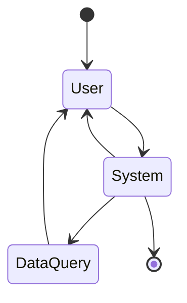

# MGFD 系統架構分析報告

**報告日期**: 2025-08-19 12:00

**系統版本**: MGFD SalesRAG Integration System v0.4
**分析範圍**: 完整系統架構、模組依賴、配置文件使用分析

## 1. 系統模組組成

### 1.1 核心模組架構

#### **主控制器層**

```
MGFDSystem (mgfd_system.py)
├── 系統初始化和協調
├── 工作流程管理
└── 統一接口提供
```

#### **輸入處理層**

```
UserInputHandler (user_input_handler.py)
├── 用戶輸入解析
├── 槽位提取協調
└── 狀態更新管理
```

#### **回應生成層**

```
ResponseGenerator (response_generator.py)
├── 回應格式化
├── 前端渲染信息
├── 多類型回應處理
└── JSON序列化
```

#### **知識庫層（整合Chunking搜尋核心）**

```
NotebookKnowledgeBase (knowledge_base.py)
├── 產品數據管理
├── Chunking搜尋引擎整合
│   ├── ProductChunkingEngine - Parent-Child分塊策略
│   ├── 語義嵌入向量生成
│   └── 餘弦相似度計算
├── 語義搜索（基於Chunking）
└── 智能推薦引擎
```

### 提示工程管理層

```
PromptManager (prompt_manager.py)
├── 依據情境選擇合適的提示
├── 提示庫建立與管理
├── 提示內容語義比對
├── 自動化提示生成系統的規劃與實驗
├── To-Add
└── To-Add
```

### 狀態管理層

```
StateManager (state_manager.py)
(MGFD State Manager Merges state persistence (Redis) and state transition logic (State Machine))
├── 狀態轉換管理
├── 流程控制
├── 事件處理
├── 會話狀態持久化
├── 對話歷史管理
├── 槽位信息存儲
└── 
```

# 1.2 模組功能詳細分析

### 所有模組運作總述：

* 狀態管理
  每一個新的客戶與AI會話開始，在redis中就要建立一個Chat State Machine:



整個對話的完整流程即依照這個State Machine在進行。 User與System間會經常有溝通進行，System對話的目的在收集槽位(slot)資訊。

整個行為的流程如下：

1. user input -> api router -> MGFDSystem
2. 


---


我會先用一個案例來描述這個系統的完整且符合預期的行為。

case-1:
user-input-1 :"請介紹目前新出的筆電"-> system:各模組進行處理，發現需要啟動funnnel chat進行槽位資料收集->system:依照預設的槽位資料收集的問題向客戶詢問->客戶回答->[optional:若預到系統無法理解的字詞，請詢問LLM，並產生回答與客戶進行確認，直到確定後，再繼續進行槽位資料收集]->system進行槽位資料收集->直到槽位資料滿足可以進行產品查詢->**system使用Chunking語義搜尋引擎進行產品搜尋**->呈現產品詳細規格給客戶。

---

### 1.3 **Chunking搜尋核心整合說明**

### Chunking架構優勢：

1. **Parent-Child分層結構**：每個產品生成1個父分塊（概覽）+ 4個子分塊（效能、設計、連接性、商務）
2. **語義搜尋能力**：基於sentence-transformers模型，支援自然語言查詢
3. **多維度匹配**：從不同角度（效能、便攜性、商務需求）匹配用戶需求
4. **相似度評分**：提供匹配度百分比和推薦原因，增強用戶體驗

### 搜尋流程：

1. 槽位信息 → 構建搜尋查詢文本
2. 生成查詢嵌入向量
3. 與產品分塊庫進行餘弦相似度計算
4. 返回相似度>30%的分塊結果
5. 轉換為產品列表，包含匹配原因和評分

以上是一個基於Chunking語義搜尋的完整流程，已成功整合到Case-1系統功能中。
