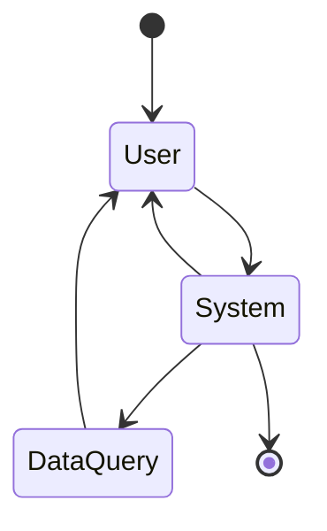

# Stat_Manager 狀態機使用說明

## 概述

`Stat_Manager.py` 是一個基於 Mermaid 圖表實現的對話狀態機，用於管理用戶和AI之間的對話流程。

### Mermaid 狀態圖



## 核心組件

### 1. 狀態枚舉 (ChatState)

```python
class ChatState(Enum):
    INITIAL = "initial"      # 初始狀態 [*]
    USER = "user"           # 用戶狀態
    SYSTEM = "system"       # 系統處理狀態
    DATA_QUERY = "data_query"  # 數據查詢狀態
    FINAL = "final"         # 結束狀態 [*]
```

### 2. 狀態轉換 (StateTransition)

定義狀態之間的轉換規則，包含條件和動作：

```python
transition = StateTransition(
    from_state=ChatState.USER,
    to_state=ChatState.SYSTEM,
    condition=lambda ctx: ctx.get('user_input') is not None,
    action=process_user_input,
    description="處理用戶輸入"
)
```

### 3. 聊天事件 (ChatEvent)

表示觸發狀態轉換的事件：

```python
event = ChatEvent("user_input", {
    "user_input": "我想查詢筆電規格",
    "direct_response": False,
    "needs_data_query": True
})
```

### 4. 狀態管理器 (StatManager)

主要的狀態機實現類，管理整個對話流程。

## 使用方法

### 基本使用

```python
from libs.mgfd_modules.Stat_Manager import StatManager, ChatEvent

# 創建狀態管理器
manager = StatManager("session_001")

# 處理用戶輸入
user_event = ChatEvent("user_input", {
    "user_input": "我想查詢筆電規格",
    "direct_response": False,
    "needs_data_query": True
})

# 處理事件
if manager.process_event(user_event):
    print(f"當前狀態: {manager.get_current_state().value}")
```

### 完整對話流程示例

```python
# 1. 用戶輸入
user_event = ChatEvent("user_input", {
    "user_input": "你好，我想了解筆電推薦",
    "direct_response": False,
    "needs_data_query": True
})
manager.process_event(user_event)

# 2. 數據查詢
data_event = ChatEvent("data_query", {
    "data_query": "查詢筆電推薦",
    "data_results": "根據您的需求，推薦以下筆電..."
})
manager.process_event(data_event)

# 3. 系統回應
response_event = ChatEvent("system_response", {
    "direct_response": True
})
manager.process_event(response_event)
```

## 主要功能

### 1. 狀態查詢

```python
# 獲取當前狀態
current_state = manager.get_current_state()

# 獲取對話摘要
summary = manager.get_conversation_summary()
```

### 2. 上下文管理

```python
# 更新上下文
manager.update_context({
    "user_preferences": {"budget": "30000", "usage": "gaming"},
    "current_topic": "筆電推薦"
})

# 獲取上下文
context = manager.get_context()
```

### 3. 手動狀態轉換

```python
# 手動轉換到指定狀態
manager.transition_to(ChatState.SYSTEM, "手動轉換到系統狀態")
```

### 4. 對話重置

```python
# 重置對話狀態
manager.reset_conversation()
```

### 5. 對話導出

```python
# 導出對話日誌
export_path = manager.export_conversation_log()
```

## 狀態轉換規則

### 自動轉換

1. **INITIAL → USER**: 開始對話
2. **USER → SYSTEM**: 有用戶輸入時
3. **SYSTEM → USER**: 需要直接回應時
4. **SYSTEM → DATA_QUERY**: 需要查詢數據時
5. **DATA_QUERY → USER**: 數據查詢完成後
6. **SYSTEM → FINAL**: 結束對話時

### 轉換條件

- `user_input`: 用戶輸入內容
- `direct_response`: 是否需要直接回應
- `needs_data_query`: 是否需要數據查詢
- `end_conversation`: 是否結束對話

## 整合到 MGFD 系統

### 在 MGFD 系統中使用

```python
from libs.mgfd_modules.Stat_Manager import StatManager

class MGFDSystem:
    def __init__(self):
        # 初始化狀態管理器
        self.stat_manager = StatManager()
    
    def process_message(self, session_id: str, user_message: str):
        # 創建用戶輸入事件
        user_event = ChatEvent("user_input", {
            "user_input": user_message,
            "direct_response": False,
            "needs_data_query": True
        })
        
        # 處理事件
        self.stat_manager.process_event(user_event)
        
        # 根據當前狀態決定下一步操作
        current_state = self.stat_manager.get_current_state()
        
        if current_state == ChatState.SYSTEM:
            # 處理系統邏輯
            pass
        elif current_state == ChatState.DATA_QUERY:
            # 執行數據查詢
            pass
```

## 測試

運行測試文件來驗證功能：

```bash
python test_stat_manager.py
```

測試包括：
- 基本對話流程
- 直接回應流程
- 對話結束流程
- 手動狀態轉換
- 上下文管理
- 對話導出
- 重置功能

## 注意事項

1. **簡化設計**: 當前實現採用簡化設計，便於後續修改和擴展
2. **事件驅動**: 所有狀態轉換都通過事件觸發
3. **上下文保持**: 對話上下文在整個會話期間保持
4. **日誌記錄**: 所有狀態變化和對話內容都會被記錄
5. **可擴展性**: 可以輕鬆添加新的狀態和轉換規則

## 未來擴展

1. **Redis 整合**: 可以整合 Redis 來持久化狀態
2. **LLM 整合**: 可以整合 LLM 管理器來生成回應
3. **更多狀態**: 可以添加更多狀態來處理複雜對話
4. **條件優化**: 可以優化轉換條件邏輯
5. **性能優化**: 可以優化大量並發會話的處理
